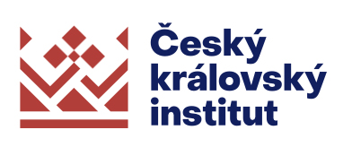
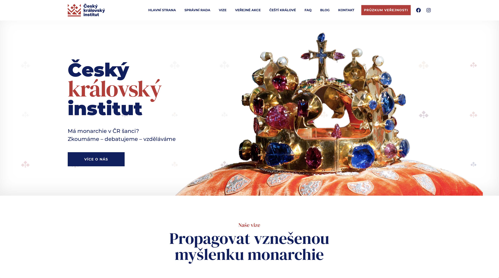
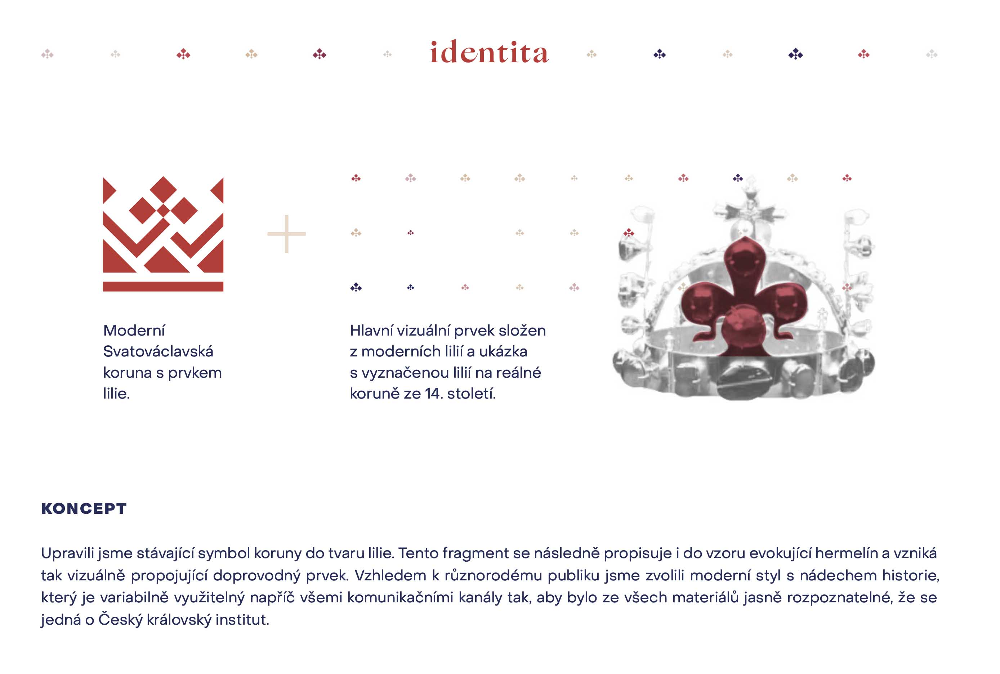
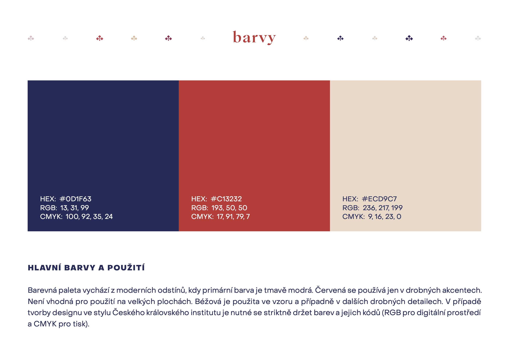
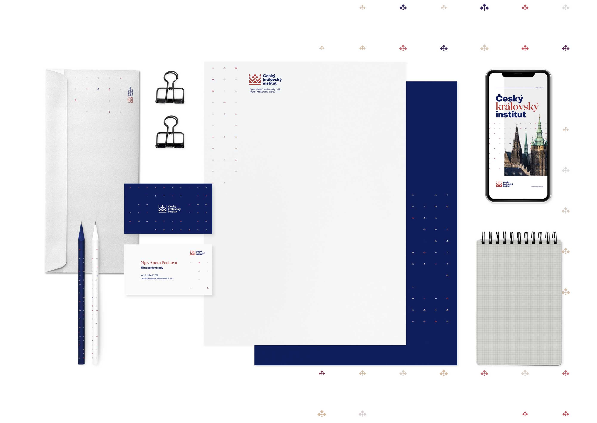
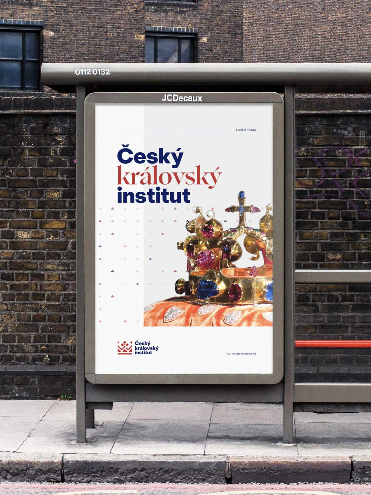

# Content first

I am currently studying at VŠKK. I started with design in high school where I learned the basics. I have been learning design for 9 years now. I enjoy designing and creating and my experience continues to grow. I like to learn new techniques.

Besides designing, I enjoy filming and photography. Sometimes I make amateur films with my friend, which we put on youtube and enter them in various amateur competitions.

I choose the CKI redisgn brand. I think it's a redesign that will help the brand.

## The Problem
The customer wanted to modernize the existing logo of the Český královský institut. There was no logo manual created for the logo, no clear rules for using the logo. The red colour was difficult to use in print.

## Solution
Redesign of the existing logo. Choice of main font and secondary font.

## Result
Created a logomanual that explains the use of the logo on social media and in print. Fonts, colours and usage are prescribed. The customer was very happy with the result

