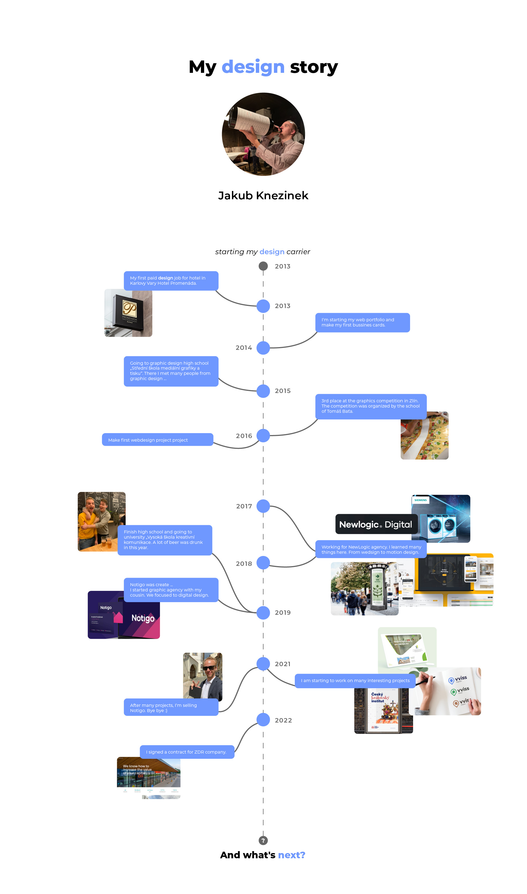

# Storytelling

My design story

by Jakub Knezinek

I would like to tell you a story mainly about the idea, money and sales. It's about my former company Notigo.
It's a story of friendship and then enmity.

It's 2019, I'm full of energy, I'm about to graduate and I'm full of ideas. I've been trying to start my own business since 2014 and 2019 was supposed to be my new official bussineess starter.
My cousin was studying law in business and I was just finishing graphic design school. I wanted to be an entrepreneur, I wanted to create but I didn't have much experience with starting a business, accounting, contracts, etc.
So I approached my cousin and asked him? Do you want start business with me? He said yes! Thus began the journey of a company that didn't even have a name, a logo, a headquarters, nothing yet.

It didn't take long for us to have our first meeting at my cousin's house. It was actually more of a work-related weekend.
We were looking for the perfect name. We couldn't think of anything. The only thing we came up with was a customer system. Well... at least something.

We reconvened a week later. I came to the meeting and I said, "I got it! It's going to be a Notigo." He thought for a second (it took a while) but said yes. Within a week, the logo, website, business cards, promotions, Instagram, Facebook were all figured out. We were ready, so we saw a lawyer and the company was formed. Notigo was created!

It was a beautiful feeling. I have a graphic design agency? Yes :) Yeah, but what now?

The first week we worked almost 20 hours a day. My cousin was looking for jobs, doing contracts, bookkeeping. I did the contracts, I did the people, I did the marketing for Notigo. It was pretty good. The first month we had some pretty good contracts. But we still didn't have an office. We worked at my house, at my cousin's house, and mostly in coffee shops. It wanted an office.

We started looking. We looked at about six spaces. But we didn't like anything much and we didn't want to spend a lot of money. It would have cost a lot.
But my cousin's dad had a possible solution for us. He had a warehouse with a garage where there was a free piece of space. It wasn't a luxury, but we took it. So it was a place where it was warm and it was free.
We bought some furniture and the office was ready. It wasn't quite an office for client meetings, but it was enough for work.
We were working, we were building a business, we were making money. Clients were coming in, there were enough orders. We operated like that for about another year and a half. Everything was okay. But after a year and a half, the tide turned. I moved on, at that time I was still studying at VŠKK and my cousin moved on. Everyone changed their views a little. It was a strange time. Gradually we had completely different views about the future of the company. It didn't work. It stopped working.

To move on, I had to either buy Notigo or leave Notigo. The company I built. There was a big but!
The bid price was too high. I was making a decision and I didn't know.
Should I leave the company and sell it? Or buy his part of the company from my cousin. I deliberated for a long time, consulted and finally decided to sell the company. It was a small end but a big beginning.

I used the money to grow my current business. I decide on my own strategy and I am happy. Notigo continues to be run by my cousin as he sees fit.

This was Notigo's story and my story.
