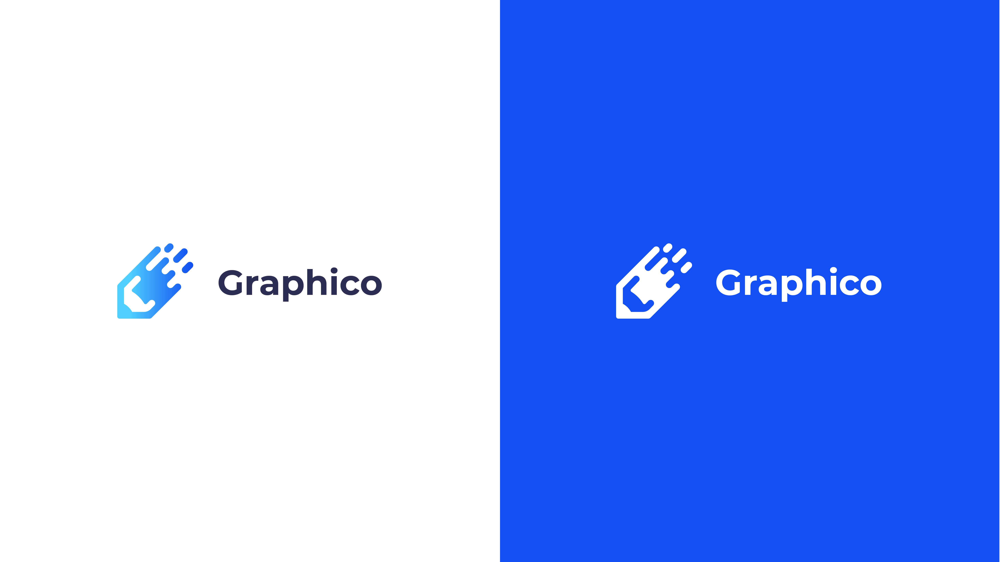
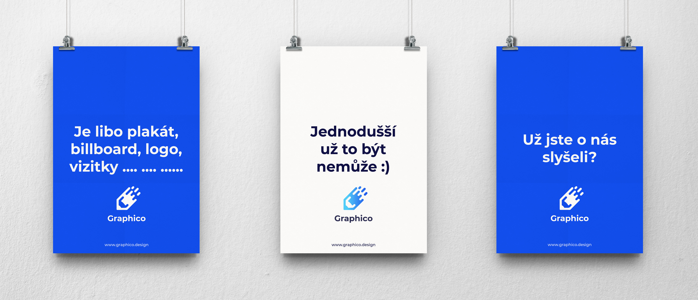
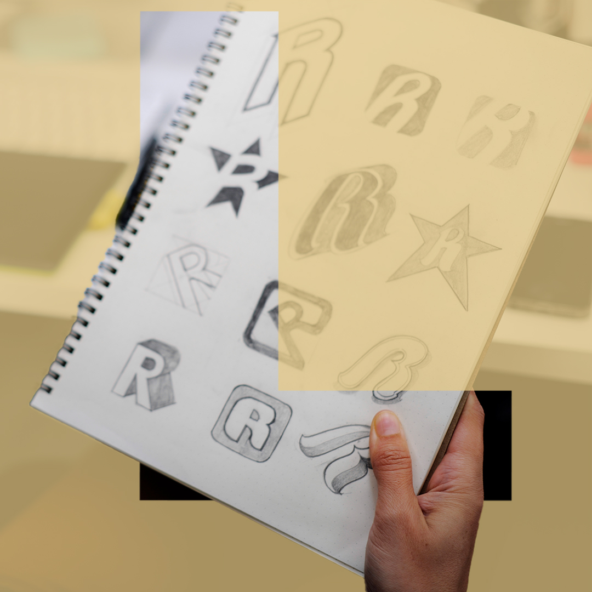

# Thesis presentation

## Title: Corporate identity design for the graphic platform Graphico
Author Name: Jakub Knezinek

[Download PRESENTATION (PDF)](thesis_presentatio_Graphico.pdf)

This bachelor's thesis focuses on creating a corporate identity and marketing strategies for the future brand Graphico, which aspires to become a web and mobile platform providing graphic services in the Czech and Slovak markets. The goal of the thesis is to design a comprehensive visual system for the brand, reflecting its values and objectives, and to present marketing strategies that could contribute to its success in the market. The theoretical part of the thesis analyzes concepts of corporate identity, branding, marketing strategies, and the business model of the Graphico brand. In the practical part, the design of the logo, color scheme, typography, and other visual elements that form the corporate identity of the brand are presented. The result of the thesis is a comprehensive corporate identity for the Graphico brand and a proposal of marketing strategies that take into account the specifics of the Czech and Slovak markets. The thesis contributes to the theoretical and practical understanding the process of creating corporate identity and marketing strategies for a graphic platform.

Keywords
corporate identity, Graphico, graphic design, marketing strategy, branding, logo, visual style, Czech and Slovak market, web platform, graphic services

## Introduction
This bachelor thesis focuses on the creation of corporate identity and marketing strategies for the brand Graphico, which will operate in the future on the Czech and Slovak market as a web and mobile platform providing graphic services. Graphico aims to connect customers with quality graphic designers to provide them with a wide range of graphic services such as logo creation, websites, posters and many more.
The theoretical part of the thesis will elaborate on corporate identity issues, which includes an analysis of the brand, its values, visual elements and communication strategies. This part of the thesis will also focus on marketing strategies and their importance in building a brand and its position in the market. It will also describe how the Graphico brand will operate in the future, what services it will offer and what its business model will be, including its payment model and competitive strategy.
The practical part of the thesis will present the logo design and corporate identity for the Graphico brand. This design will include the development of a logotype, colour scheme, typography, visual style and other graphic elements that will form a unified visual system for the brand. The proposal will be developed taking into account the theoretical knowledge gained during the development of the thesis and will reflect the values and objectives of the Graphico brand.
The aim of this bachelor thesis is to provide a comprehensive proposal of the corporate identity for the Graphico brand and to propose marketing strategies that could contribute to its success on the Czech and Slovak graphic services market.

## Main Graphico logo - 2 colour variants

## Logo variants - vartical/horizontal

## Logo mark

## Graphico characteristics
The Graphico brand will represent an innovative web platform that will focus on facilitating the demand for graphic services in the Czech and Slovak markets. This web application will be inspired by the Fiverr platform, but will specialise only in graphic services such as logo creation, web pages, posters and many more.

## Company vision
Graphico's vision is to become the leading provider of graphic services in the Czech and Slovak market. The brand aims to provide high quality, affordable and professional services that will make it easier for customers to implement their creative projects and support the growth of their business. Graphico aims to create a community of talented and reliable designers who will be able to offer their services to a wide range of customers, helping to bridge the gap between customers and creative professionals.
Graphico's mission is to create a platform that allows easy access to a wide range of graphic design services, simplify communication between customers and designers, and increase the efficiency of the entire process of ordering and completing projects. The brand is also committed to supporting local talent and businesses by providing them with the tools and opportunities to grow and develop.
In the long term, Graphico wants to be seen as a trusted and innovative brand that delivers value and satisfaction to customers and designers. Graphico aims to achieve this by continuously improving its services, technologies and tools to make it easier for customers and designers to collaborate and create successful projects.
In line with this vision and mission, Graphico will work tirelessly to strengthen its position in the market, building a strong brand and support for its community of designers and customers. In this way, Graphico will contribute to the creative growth and development of the Czech and Slovak graphic services market.

## How communication will works on posters

## How communication will works on socials. The brand will communicate through typography and images in the cut.

## Conclusion
In my bachelor thesis I focused on the design of corporate identity and marketing strategies for the brand Graphico, which is to operate in the future on the Czech and Slovak market as a web and mobile platform providing graphic services. The aim of the work was to design a comprehensive visual system for the brand that would match its values and goals, and to present marketing strategies that could contribute to its success on the market.
